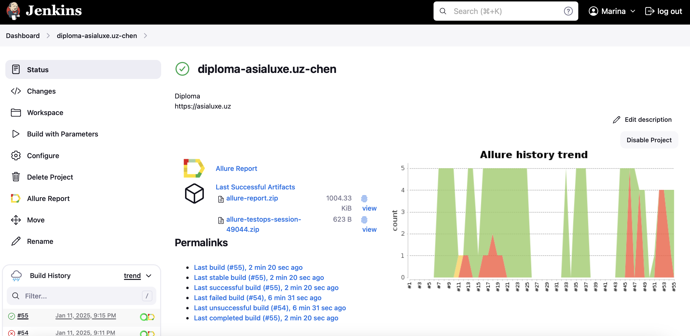

<h2>Проект автоматизации тестирования туристического агентсва <a target="_blank" href="https://asialuxe.uz/ru"> Asialuxe.uz</a></h2>
<p>

</p>

## Содержание
+ [Описание](#Описание)
+ [Технологии и инструменты](#Технологии-и-инструменты)
+ [Реализованные проверки](#Реализованные-проверки)
+ [Запуск тестов](#Запуск-тестов)
    + [Допустимые комбинации](#Схема-комбинаций-по-запуску-автотестов)
    + [Локальный запуск тестов](#Локальный-запуск-тестов)
    + [Удаленный запуск тестов](#Удаленный-запуск-тестов)
+ [Интеграция с Jenkins](#Интеграция-с-Jenkins)
+ [Интеграция с Allure Report](#интеграция-с-allure-report)
    + [Диаграммы прохождения тестов](#Диаграммы-прохождения-тестов)
    + [Развернутый результат прохождения тестов](#Развернутый-результат-прохождения-тестов)
+ [Интеграция с Allure TestOps](#Интеграция-с-Allure-TestOps)
+ [Уведомления в Telegram с использованием бота](#Уведомления-в-Telegram-с-использованием-бота)
+ [Интеграция с Jira](#Интеграция-с-Jira)
+ [Пример выполнения теста в Selenoid](#Пример-выполнения-теста-в-Selenoid)

## Технологии и инструменты
<div>
<a href="https://www.java.com/"></a>
<a href="https://github.com/"></a>
<a href="https://www.jenkins.io/"></a>
<a href="https://github.com/allure-framework/"></a>
<a href="https://www.browserstack.com/"></a>
<a href="https://aerokube.com/selenoid/"></a>
<a href="https://www.jetbrains.com/idea/"></a>
<a href="https://gradle.org/"></a>  
<a href="https://developer.android.com/studio"></a>
<a href="https://telegram.org/"></a>

<a href="https://junit.org/junit5/"></a>
<a href="https://selenide.org/"></a>
<a href="https://rest-assured.io/"></a>
<a href="https://appium.io/"></a>
<a href="https://qameta.io/"></a> 
</div>

## Описание
Asialuxe Travel — крупнейший туроператор Узбекистана, предлагающий высококачественные услуги как для выездного, так и въездного туризма. <br/>

**Особенности проекта**:
- В проекте используется JUnit 5 — это современный фреймворк для модульного тестирования на Java. Он предоставляет мощные возможности для написания, организации и выполнения тестов, поддерживая аннотации для удобства и гибкости.
- Jenkins и Allure тесно интегрируются для автоматизации процессов тестирования и наглядного представления результатов. Jenkins используется для запуска тестов, организации пайплайнов и управления CI/CD процессами.
- Использование <a target="_blank" href="https://app-automate.browserstack.com/">Browserstack.com</a> для прогона автотестов для мобильного устройства
- Использование техноголии `Owner` для придания тестам гибкости и легкости конфигурации
- Использование `Lombok` для моделей в API тестах
- Использование собственных расширений:
    - `@WithLogin` для предварительной авторизации 
- Возможность запуска тестов напрямую из Allure TestOps
- Allure TestOps - платформа для управления процессом тестирования, предоставляющая возможности анализа, организации и визуализации тестовых данных. Она является расширением Allure Report и предназначена для комплексного подхода к управлению тестами в больших командах.
    - Централизованное управление тестами
    - Анализ тестирования
    - Интеграция с CI/CD
    - Поддержка ручного и автоматического тестирования
- Уведомление о результатах прохождения в Telegram
- Allure report - инструмент для генерации интерактивных отчетов о тестировании. Он используется для визуализации результатов тестов, включая успешные и проваленные тесты, шаги их выполнения, причины ошибок, скриншоты и другие данные.
- По итогу прохождения автотестов генерируется Allure report. Содержание отчета:
    - Шаги теста
    - Скриншот страницы на последнем шаге
    - Исходный код страницы в браузере
    - Логи консоли браузера
    - Видео выполнения автотеста
- Selenoid - высокопроизводительный сервер для управления браузерами. Он используется для выполнения автоматизированных тестов в изолированных окружениях и поддерживает множество версий браузеров.
    - Основные функции Selenoid
    - Управление браузерами
    - Высокая производительность
    - Видео и логи
    - Простая настройка

## Реализованные проверки
### Web UI
- [x] Проверка текста в меню находящемся в хэдере сайта
- [x] Сообщение о некорректном вводе данных авторизации
- [x] Отображение сообщения при поиске билетов
- [x] Сценарий Сброса пароля без подтверждения
- [x] Смена цвета поля Номер телефона при регистрации пользователя
### API
- [x] Негативный тест по бронированию тура. Тест содержит UI+API autotests
- [x] Удаление пассажира на странице Мой Профиль->Пассажиры
- [x] Редактирование данных пассажира
- [x] Удаление несуществующего пассажира
- [x] Создать пассажира на странице Мой Профиль->Пассажиры
- [x] Негативный тест по проверке бронирования билета с невалидными данными
- [x] Проверка по получению полного списка броней пользователя
### Mobile
- [x] Проверка заголовка странице Профиль-> О Компании
- [x] Проверка заголовок на домашней странице
- [x] Проверка заголовка странице Профиль-> Архив акций
- [x] Проверка адреса филиала на странице Профиль-> Где купить?
### Ручные проверки
- [x] Проверка данных на странице Настройки пассажиров 
- [x] Проверка данных на странице Мой профиль 
## Запуск тестов
Конфигурационные файлы `.properties` лежат в папке `resources`. <br/>
При необходимости можно изменить их.

### Схема комбинаций по запуску автотестов

### Локальный запуск тестов
Для запуска WEB/API/Mobile автотестов следует открыть IntelliJ IDEA и выполнить в терминале команду:
#### WEB
```
gradle clean fulltest
```
#### API
```
gradle clean apitest -Denv=local 
```
#### Mobile автотесты
Для запуска автотестов используется эмулятор Android Studio <b><a target="_blank" href="https://developer.android.com/studio">Developer.android.com</a></b>, предварительно который надо установить.

```
gradle emulation -Ddevicehost=emulation
```

### Удаленный запуск тестов
Для группы WEB и API автотестов используется удаленный сервер <b><a target="_blank" href="http://selenoid.autotests.cloud">Selenoid.autotests.cloud</a></b>

```
gradle clean smoketest -Denv=remote
```

#### API автотесты
```
gradle clean apitest -Denv=remote
```
#### Mobile автотесты

```
gradle clean browserstack -Ddevicehost=browserstack
```
## Интеграция с <b><a target="_blank" href="https://jenkins.autotests.cloud/job/diploma-asialuxe.uz-chen/">Jenkins</a></b>
### Основные Функции
- Автоматический/ручной запуск тестов после обновления кода.
- Генерация отчетов о прохождении тестов.

>Для запуска сборки необходимо перейти в раздел `Build with Parameters` и нажать кнопку `Build`



> Сборка с параметрами позволяет перед запуском задать нужные параметры для сборки:

<p align="center">

</p>

## Интеграция с <b><a target="_blank" href="https://jenkins.autotests.cloud/job/diploma-asialuxe.uz-chen/allure/">Allure report</a></b>
### Основные возможности
- Графическая визуализация результатов.
- Интеграция со всеми популярными тестовыми инструментами.
- Отображение шагов выполнения тестов и логов.
- Удобный поиск по тестам.

#### Диаграммы прохождения тестов
`ALLURE REPORT` - отображает дату и время теста, общее количество запущенных тестов, а также диаграмму с процентом и количеством успешных, упавших и сломавшихся в процессе выполнения тестов <br/>
`TREND` - отображает тенденцию выполнения тестов для всех запусков <br/>
`SUITES` - отображает распределение тестов по сьютам <br/>
`CATEGORIES` - отображает распределение неудачных тестов по типам дефектов


#### Развернутый результат прохождения тестов:
1. Общий список автотестов
2. Содержание автотеста
3. Вложения


## Интеграция с <b><a target="_blank" href="https://allure.autotests.cloud/project/4549/launches">Allure TestOps</a></b>
Настройка джобы

Вызов автотестов из allure.autotests.cloud

Результат прогона задачи

Ручные тесты

## Уведомления в Telegram с использованием бота

> Бот, созданный в Telegram, после завершения сборки отправляет сообщение с отчетом о прохождении тестов


## Интеграция с <b><a target="_blank" href="https://jira.autotests.cloud/browse/HOMEWORK-1380">Jira</a></b>

>В Jira создана задача

>В разделе `Allure:Test Cases` отображаются интегрированные автоматизированные и ручные тесты


> К каждому UI-тесту в отчете прилагается видео
<p align="center">
  
</p>

> К каждому мобильному тесту, выполняемому в Browserstack, к отчету прилагается видео
<p align="center">
  
</p>
